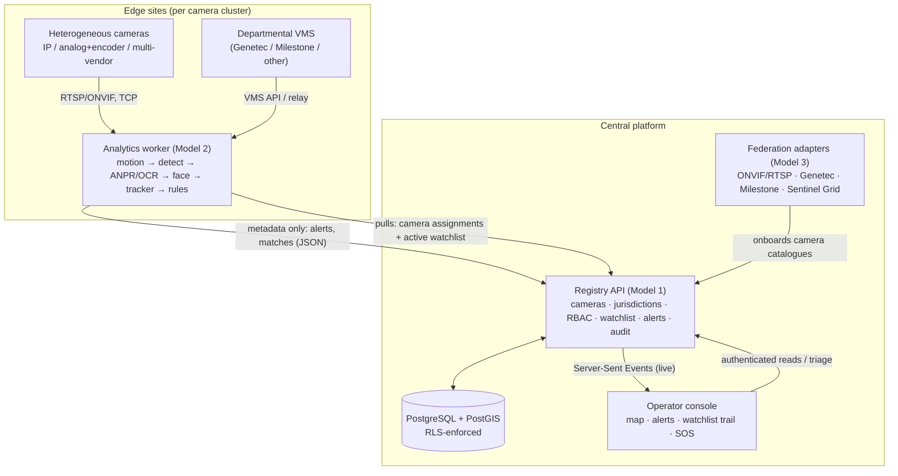
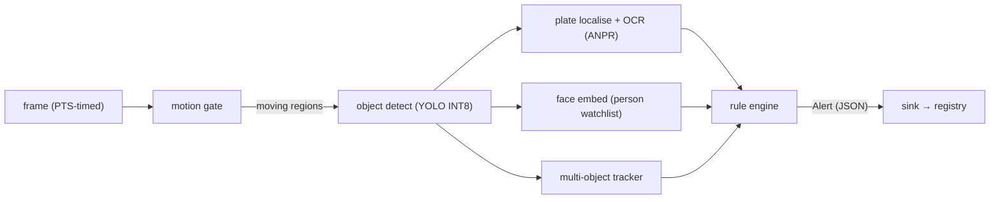
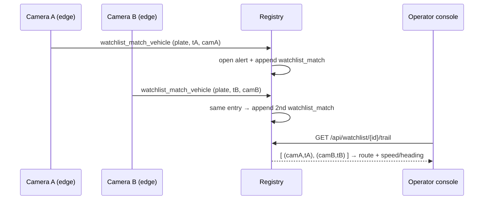

# Sentinel — High-Level Design (Technical Proposal)

Gujarat CCTV Integration Hackathon 2026. This document is the Technical Proposal
/ HLD: the model chosen and why, the solution architecture with diagrams, the
approach to integrating heterogeneous cameras and VMSs, handling geographically
dispersed locations, the video-analytics approach (ANPR and cross-camera
tracking), the scalability approach for ~80,000 cameras, and the department-level
technical detail needed to make integration feasible.

Companion documents: **`SECURITY.md`** (authorization, audit, credentials) and
**`SCALE.md`** (the 80,000-camera sizing plan). This HLD summarises both and
points to them for depth.

## 1. Model chosen, and why

The reference challenge offers five solution models. Sentinel implements
**Models 1, 2 and 3 as one layered platform**, rather than picking one or
building three disconnected products — because in the field they are not
alternatives, they are layers of the same system:

| Layer (this repo) | Reference model | Role |
|---|---|---|
| `services/registry` | **Model 1** (mandatory) | System of record: camera metadata, GIS, jurisdiction hierarchy, RBAC, audit, the API surface, the watchlist/alert store. |
| `services/registry/app/federation` | **Model 3** | Adapter/plugin framework + metadata/event bus — the integration substrate for heterogeneous cameras and VMSs. |
| `services/analytics` | **Model 2** | Edge analytics: unified viewing metadata, ANPR, event indexing, watchlist matching, alerts. |

**Justification.** Model 1 is the spine both others depend on — you cannot
correlate a plate across cameras without a trustworthy registry of *which camera
is where, in whose jurisdiction, and who may see it*. Model 2 (direct-connect
analytics) and Model 3 (VMS-federated integration) are two ingestion modes of
the *same* platform, selected per camera by configuration: a camera reachable
directly by RTSP/ONVIF is a Model-2 path; one behind a departmental Genetec or
Milestone VMS is a Model-3 path. Building them as one layered system — instead
of three silos — is what lets a single console show every camera and a single
watchlist match across all of them, which is the actual public-safety outcome
the challenge asks for.

## 2. Solution architecture

Two properties are visible in the diagram and are the heart of the design:
**only metadata crosses the edge boundary** (never continuous video), and
**every path terminates at the RLS-enforced database**, which is the single
authorization authority (see `SECURITY.md`).

## 3. Integrating heterogeneous cameras and VMSs (Model 3)

Real deployments are never one vendor. Sentinel integrates diversity behind a
single driver interface (`federation/base.py`), with concrete adapters:

- **ONVIF / RTSP direct-connect** (`onvif_rtsp.py`) — IP cameras and NVRs that
  speak standard protocols; the Model-2 path. Analog cameras are handled the
  same way once behind an encoder/DVR that exposes RTSP.
- **Genetec** and **Milestone** (`genetec.py`, `milestone.py`) — the two most
  common departmental VMS platforms, integrated via their APIs; the Model-3
  path, for cameras a department will not expose directly.
- **Sentinel Grid** (`sentinel_grid.py`) — the hackathon's government camera
  grid, consumed from its `cameras.json` catalogue.

Adding a department's VMS is a new adapter implementing one interface, plus a
row of configuration — not a change to the core. Varied protocols, credentials,
and inventory shapes are normalised into one `ForeignCamera` record and one
`app.camera` row, so everything downstream (console, analytics, watchlist) is
protocol-agnostic. Onboarding is **catalogue-driven**: `onboard_grid` reads a
department's camera catalogue and registers the whole set — with locations and
stream endpoints — in one idempotent run, which is what makes onboarding a large
grid a data operation rather than manual data entry (directly addressing the
graded "onboarding efficiency").

Mixed codecs and resolutions are expected, not assumed away: the analytics
ingestion (`source.py`) reads per-camera properties and handles H.264 and H.265,
varied resolutions, RTSP-over-TCP, PTS-based timing, buffered-GOP joins, decoder
warnings on mid-stream attach, scene-loop discontinuities, and reconnect with
backoff — the full list of ways a live grid breaks naïve pipelines.

## 4. Geographically dispersed locations, bandwidth, edge vs. central

Cameras are spread across the state — in this grid alone, from Ahmedabad to
Junagadh, Rajkot, Navsari, Patan, Banaskantha, Kutch and beyond. The design
consequence is decided deliberately: **inference runs at the edge, only metadata
travels to the centre.** Shipping raw video centrally would be ~160–320 Gbps for
80,000 cameras and is infeasible; shipping metadata is a few Mbps. Full sizing,
per-tier hardware, and the bandwidth arithmetic are in `SCALE.md §1–§3`. Edge
workers are stateless and pull their configuration from the registry, so a
dispersed fleet is operated centrally without central video ingest.

## 5. Video analytics approach

The pipeline is a cost-ordered cascade — cheapest rejection first — so the
expensive stages run on almost nothing:

- **ANPR** — plates are localised geometrically (no extra model), read by OCR,
  and **never character-substituted** to "fix" OCR confusions: a substituted
  character is a fabricated one, and both the raw and normalised reads are kept
  for evidence (see `stages/plate.py`). A once-per-track dedupe reads a vehicle
  once, not once per frame.
- **Cross-camera vehicle tracking** — the graded live test case. A plate that
  matches a watchlist entry raises a `watchlist_match_vehicle` alert carrying
  the camera, timestamp and plate; every such match is appended to
  `app.watchlist_match`. Two matches for the same entry at two cameras are, *by
  construction*, two points on the map at two times — a trail — with no separate
  tracking subsystem and no biometric identity resolution. `GET
  /api/watchlist/{id}/trail` returns the complete, timestamped, location-wise
  movement history, and the console computes speed and heading between sightings.

- **Person watchlist** — matches a face crop against an *individually enrolled*
  wanted/missing-person photo (a one-to-few comparison against a consented,
  auditable list), never demographic inference. The system deliberately has no
  gender/age/caste/religion/ethnicity field anywhere.
- **Women's safety** — behavioural, geometry-only signals (a lone person
  followed, or encircled, in a flagged zone or after dark) plus an
  unauthenticated `POST /api/sos` panic path that opens a critical alert with no
  login required. No appearance-based signal is used.
- **Other analytics** — abandoned object, crowd surge, speed violation
  (enforced on the measurement's lower bound, not the point estimate), and
  prolonged stream-gap coverage alerts.

Every alert keeps its provenance (which primitives produced it), so an operator
sees both the judgement and the raw evidence — explainable, auditable analytics.

## 6. Scalability approach (~80,000 cameras)

Summarised here, detailed in `SCALE.md`. The metadata-not-video decision (§4)
makes the bandwidth tractable; edge inference makes compute linear and
per-district (~1,600–3,200 edge boxes for 80,000 cameras, each serving 25–50
cameras — method and assumptions in `SCALE.md §2`); the RLS model stays flat
because every policy filters on indexed columns (`SCALE.md §6`); storage is
metadata-only with monthly range-partitioning and archival (`SCALE.md §4`); and
rollout is phased on the jurisdiction tree, catalogue-driven per district
(`SCALE.md §7`).

## 7. Security & compliance

Summarised here, detailed in `SECURITY.md`. Authorization is enforced in the
database via Row-Level Security, not the application: the app asserts one claim
(`app.user_id`) and all scope is derived by `SECURITY DEFINER` functions, so a
compromised application cannot widen its access. The app role is
`NOSUPERUSER`/`NOBYPASSRLS`. The audit trail is append-only and hash-chained by
database trigger, independently re-verifiable, recording purpose and case
reference per access (DPDP Act 2023 alignment). Camera credentials are encrypted
with a wrapped-DEK envelope. 198 mostly-adversarial tests cover the security
core.

## 8. Department-level technical details needed for integration feasibility

To onboard a department's cameras, Sentinel needs the following from that
department — this is the concrete integration checklist:

1. **Camera inventory / catalogue** — a list of cameras with ids, names and
   locations (lat/lon or an address to geocode). A machine-readable catalogue
   endpoint (as the government grid provides at `cameras.json`) makes onboarding
   automatic; a spreadsheet is sufficient otherwise.
2. **Stream access** — per camera: protocol (RTSP/ONVIF/HLS/WebRTC), endpoint
   URL or host/port, and codec if known. For direct-connect (Model 2).
3. **Or VMS details** — if cameras are behind a VMS: platform (Genetec /
   Milestone / other), API base URL, and API credentials/service account. For
   federated integration (Model 3).
4. **Credentials** — camera or VMS username/password (stored encrypted; see
   `SECURITY.md §5`), or the access model in use (e.g. the grid's per-connection
   email+password embedded in the RTSP URL).
5. **Network reachability** — which ports must be open from the edge/processing
   network to reach the streams (e.g. the grid's 8554/TCP RTSP, 8889/TCP and
   8189/UDP WebRTC). Public/institutional networks often block non-standard
   ports; this must be confirmed per site.
6. **Jurisdiction & ownership** — which police jurisdiction and department each
   camera belongs to, so RBAC and the map scope correctly.

## 9. Verification

The claims in this document are backed by runnable checks: 198 security-core
tests and 42 analytics tests (`python -m unittest discover`), a built-in
end-to-end pipeline self-test (`python -m services.analytics.main --self-test`,
no GPU needed), and the audit-parity SQL (`db/verify_parity.sql`). The live
onboarding of all 30 government cameras and the two-camera vehicle-trail output
were verified against a real database. See `BUILD_AND_TEST_PLAN.md` for the full
per-model build and test plan.
